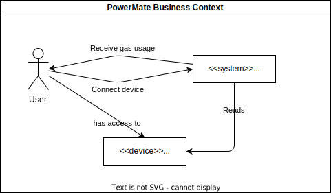
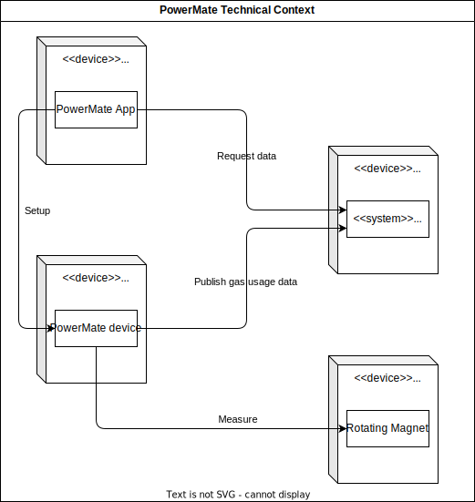

[[_TOC_]]

## 3.1 Business Context

| Component | Description |
| --- | --- |
| User | The user is the person who wants to know their gas usage. |
| Gas Meter | The user must have access to a gas meter they want to measure. This gas meter must be equipped with a rotating magnet |
| PowerMate system | The PowerMate system abstractly describes all components of the system. |

## 3.2 Technical Context

| Component | Description |
| --- | --- |
| Phone with PowerMate App | The user uses the PowerMate app on their phone to read the gas meter. |
| ESP8266 with PowerMate device | The ESP8266 is a microcontroller that is connected to the gas meter and reads the gas consumption. Other devices such as Raspberry Pis or old mobile phones could be used as well, the rest stays the same. |
| AWS Cloud with PowerMate system | The AWS Cloud is used to store the data from the gas meter and to make it available to the user. |
| Gas meter with rotating magnet | The gas meter is equipped with a rotating magnet that is measured by the ESP8266. |
