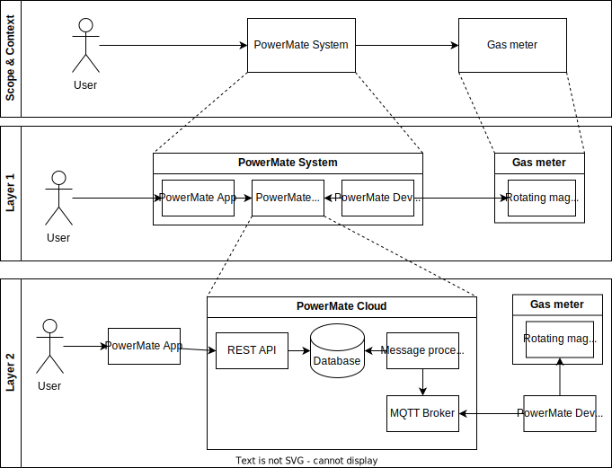

[[_TOC_]]

## Layer diagram

## Scope & Context

See [Context](./03.-Context.md)

## Layer 1

| Name             | Responsibility                                                                                                                                |
|------------------|-----------------------------------------------------------------------------------------------------------------------------------------------|
| User             | The user of the application.                                                                                                                  |
| Rotating Magnet  | Located on the smallest rotating digit wheel in the gas meter.                                                                                |
| PowerMate App    | The app is the main interaction point for users.                                                                                              |
| PowerMate Cloud  | The PowerMate cloud is responsible for everything that happens in the background without user interaction.                                    |
| PowerMate Device | Can be an ESP8266, Raspberry Pi or an old mobile phone. The device measures the rotating magnet and derives the current gas consumption rate. |

### Blackbox: PowerMate App

#### Purpose / Responsibility

The PowerMate app is the main interaction point for users. It is responsible for the following tasks:

- Display the current gas consumption rate
- Display historic gas consumption rates
- Perform initial setup for PowerMate devices
- Act as a PowerMate device (if attached to the gas meter)

#### Interface(s)

The PowerMate app has the following interfaces:

- Visual and interactive interface for users containing for example graphs
- Communicates to the PowerMate Cloud via a REST API over HTTPS
- if being used as PowerMate device: to gas meter via magnet sensor

#### (Optional) Quality / Performance Characteristics

The graphs and colors in the app should be accessible for color-blind people;
thus we use colors that are distinguishable for people with the most common types of color blindness, such as viridis.

#### (Optional) Open Issues / Problems / Risks

As described in [Chapter 11](./11.-Risks.md), the [Phone as a Device](./11.-Risks.md#inadequate-prioritization-of-phone-as-a-data-collection-device) and the [datatransfer via MQTT](./11.-Risks.md#http-data-ingress) are still known issues which must be addressed.

### Blackbox: PowerMate Cloud

#### Purpose / Responsibility

The PowerMate cloud, hosted on AWS, is responsible for everything that happens in the background without user interaction, but also for providing all data required for user interaction. It is responsible for the following tasks:

- Store historic gas consumption rates
- Provide the data to the PowerMate App
- Ingress and process data from PowerMate devices
- not completely finished: act as an identity provider (user registration, validation, login, etc.)

#### Interface(s)

The PowerMate cloud has the following interfaces:

- Communicates to the PowerMate App via a REST API over HTTPS
- Receives messages from PowerMate devices via MQTT over TLS

#### (Optional) Quality / Performance Characteristics

Since all the components in this blackbox are AWS services hosted by AWS in Frankfurt (region _eu-central-1_),
the availability should be quite good.
Also, we're making use of terraform and therefore have all the services we're using described as code
(infrastructure as code).
Our gitlab CI pipeline setup allows to (semi-)
automatically deploy and prevision the requested AWS services as described via terraform.
This makes it quite easy to set up the PowerMate Cloud services on any another AWS account.

#### (Optional) Open Issues / Problems / Risks

Using services by AWS makes you dependent on AWS.
If for some reason you need to change your cloud provider or move to an on-premise system,
the migration process can become very tedious.
As of now, such a process is not described and neither foreseen.

### Blackbox: PowerMate Device

#### Purpose / Responsibility

The PowerMate device is responsible for the following tasks:

- Measure the magnetic field of the rotating magnet in 3 directions
- Use that data to derive rotation data
- Send rotation data converted to gas consumption rates to the PowerMate Cloud

#### Interface(s)

The PowerMate device has the following interfaces:

- Start a webserver for initial configuration via HTTP from the PowerMate App
- Send messages to the PowerMate Cloud via MQTT over TLS
- Magnetometer for measuring the rotating magnet's magnetic field in x,y and z direction

#### (Optional) Quality / Performance Characteristics

#### (Optional) Open Issues / Problems / Risks

The following issues are known:

- There is a lack of attachment methods/instructions that guarantees a consistent stream of magnetic field data. Maybe using a normed 3D printed case like [this for the raspberry pi device](https://www.printables.com/en/model/177553-raspi-zero-housing-for-bk-g4t-gas-meter-version-2) can help  
- Since the magnetic field data is not very consistent the deriving of raw magnet data into rotations is challenging and requires further investigation

### Blackbox: Rotating Magnet

⚠ This is an external system not under PowerMate control. ⚠

#### Purpose / Responsibility

The rotating magnet is located on the smallest rotating digit wheel in the gas meter.
One rotation of this wheel is equivalent to 0,01 m^3 of used gas.

#### Interface(s)

The rotating magnet serves as an interface to a sensor which is part of the PowerMate device.

#### (Optional) Quality / Performance Characteristics

#### (Optional) Open Issues / Problems / Risks

## Layer 2

This section will only focus on changed or new systems.

| Name               | Responsibility                                                                         |
|--------------------|----------------------------------------------------------------------------------------|
| REST API           | The REST API is used to communicate between the PowerMate App and the PowerMate Cloud. |
| Database           | The database is used to store historic gas consumption rates.                          |
| Message Processing | The message processing system is used to process messages from PowerMate devices.      |
| MQTT Broker        | The MQTT broker is used to receive messages from PowerMate devices.                    |

### Blackbox: REST API

#### Purpose / Responsibility

The REST API is used by the PowerMate App to get the gas usage data from the database inside the PowerMate cloud.
Also, it can be used for registration of a new PowerMate device to the PowerMate cloud.
The different parts of the REST API are implemented as AWS lambda functions.

#### Interface(s)

The REST API has the following interfaces:

- Get historic gas consumption rates for devices
- Create new devices and get their MQTT TLS certificates
- List all devices
- ...

#### (Optional) Quality / Performance Characteristics

#### (Optional) Open Issues / Problems / Risks

The devices' data is not yet scoped to certain user identities.
While we already have done research,
decided how we want to achieve this
(see [ADR for Authentication And Authorization](./ADRs/Authentication-And-Authorization.md))
and started the implementation using AWS Cognito,
it is not finished and therefore not production ready.

### Blackbox: Database

#### Purpose / Responsibility

The database is used to store historic gas consumption rates.
It is an AWS TimeStream database.

#### Interface(s)

- AWS proprietary interface for writing and reading in an SQL like format

#### (Optional) Quality / Performance Characteristics

Have a look at the [AWS timestream SLA](https://aws.amazon.com/timestream/sla/) for more information.

#### (Optional) Open Issues / Problems / Risks

The database is very expensive (especially the write operations) for this use case (for more information see the [Amazon Timestream pricing page](https://aws.amazon.com/timestream/pricing/))
Investigation for how to make use of other services to replace timestream or use it in combination with cheaper database solutions (like RDS or S3) is required here.

### Blackbox: Message processing

#### Purpose / Responsibility

The message processing system is used to process messages from PowerMate devices.
There is currently no processing needed, but the system internally uses an SQS event queue combined with a Lambda function.

#### Interface(s)

- The MQTT Broker publishes messages to the SQS queue
- The message processing system stores the measurements from the messages in the database

#### (Optional) Quality / Performance Characteristics

No messages should be lost.

#### (Optional) Open Issues / Problems / Risks

### Blackbox: MQTT Broker

#### Purpose / Responsibility

The MQTT broker is used to receive messages from PowerMate devices.
It is an AWS IoT Core MQTT broker.
Certificate authentication is used to authenticate devices.
Devices are only allowed to publish on certain topics, defined by their certificates, which enables us to differentiate between devices securely.

#### Interface(s)

- MQTT over TLS
- Messages are forwarded to the message processing system based on rules.

#### (Optional) Quality / Performance Characteristics

#### (Optional) Open Issues / Problems / Risks

MQTT over TLS is the most secure option, and usually recommended, but it is not supported by all devices, such as some MQTT implementations for the react-native ecosystem used in the PowerMate App.
