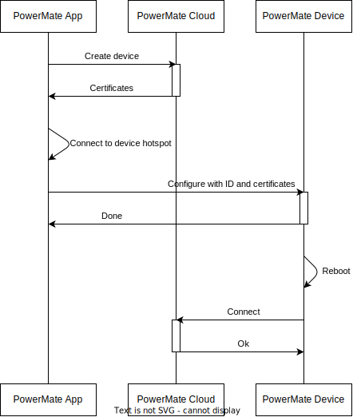
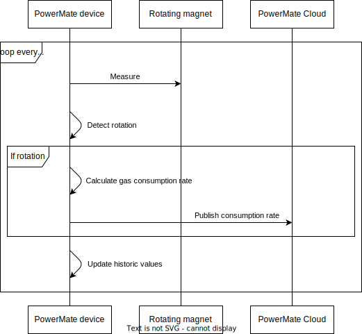
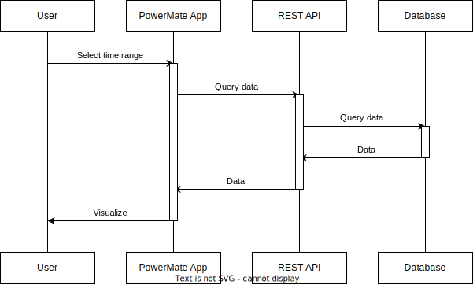

[[_TOC_]]

## Scenario: Device setup

This scenario describes the process of setting up a new device for the PowerMate platform.

1. User mounts the device with sensor at the gas meter
2. User connects the device to power
3. User opens the PowerMate App
4. User clicks on "Add Device"
5. User enters the device name and WiFi credentials
6. User clicks "Create Device"
   1. The app connects to the PowerMate Cloud and requests a new device to be created
   2. The app receives a success message with the required certificates for the further device setup.
7. User receives a success message with a hint to connect to the device's WiFi hotspot
8. User connects to the device's WiFi hotspot
9. User ignores automatic popup of the phone native hotspot connector
10. User re-opens the PowerMate App
11. User clicks "Setup Device"
    1. Being connected to the device's WiFi hotspot, the app sends a request to the device to start the setup process with the received certificates
    2. The PowerMate device stores the requested credentials and performs a reboot, signaling to the app that the setup process is finished
12. User receives a success message
13. After the reboot, the device connects to the PowerMate Cloud and starts sending data

The following diagram does not contain every step described above, and focuses more on how the components interact with each other.

## Scenario: Device measurement and data transmission

This scenario describes the process of measuring the gas consumption and transmitting the data to the PowerMate Cloud.
This requires that the device has been setup correctly.

1. The device measures the gas consumption in a loop roughly every second
2. Using historic measurements, the device tries to detect if a rotation has happened
3. If a rotation has happened:
   1. Based on the last rotation, the gas consumption rate is calculated
   2. A MQTT message is sent to the PowerMate Cloud with the calculated gas consumption rate
   3. Update the timestamp of the last rotation to this timestamp
4. The historic values get updated
5. Go back to step 1

The following diagram does not contain every step described above, and focuses more on how the components interact with each other.

## Scenario: Data querying

This scenario describes the process of querying the data from the PowerMate Cloud.
Required is that the user has setup the app and device, and that the device is sending data correctly to the PowerMate Cloud.

1. User opens the PowerMate App
2. User selects a time frame to query the data for
3. The App queries the data in the background from the cloud
4. The App displays the queried data
   1. as a graph
   2. and as current gas consumption rate

The following diagram does not contain every step described above, and focuses more on how the components interact with each other.

