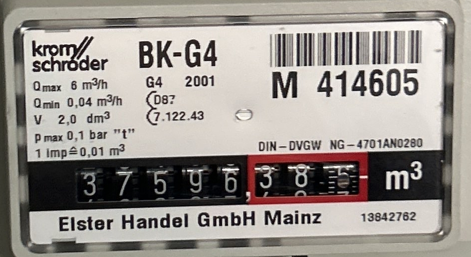
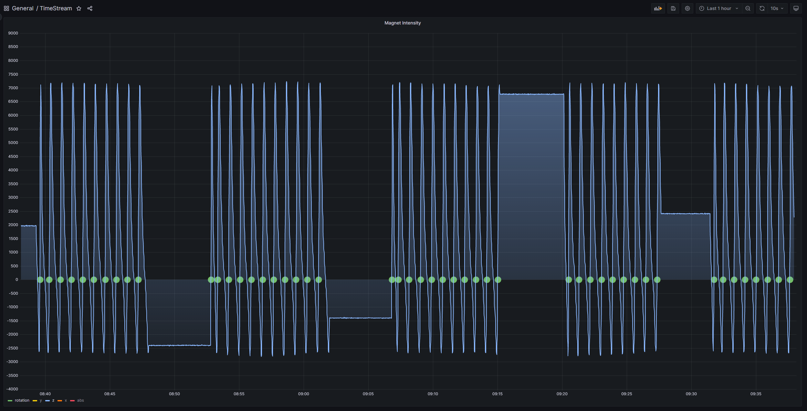
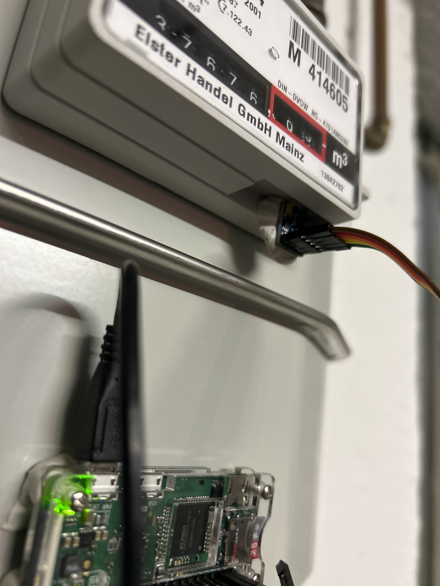
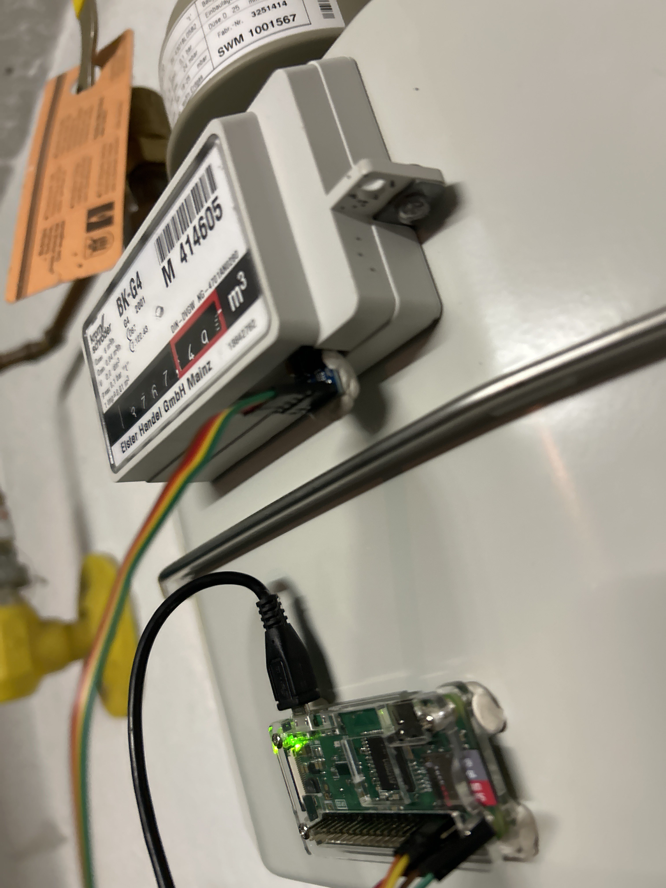
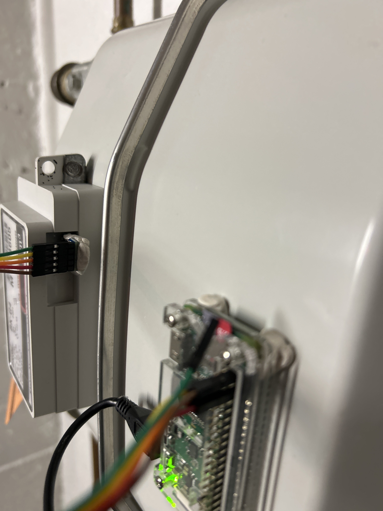
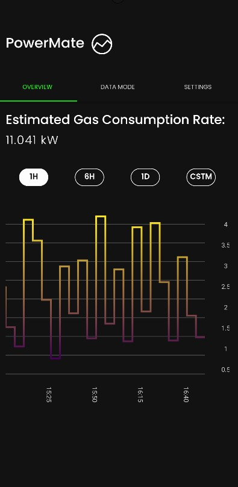
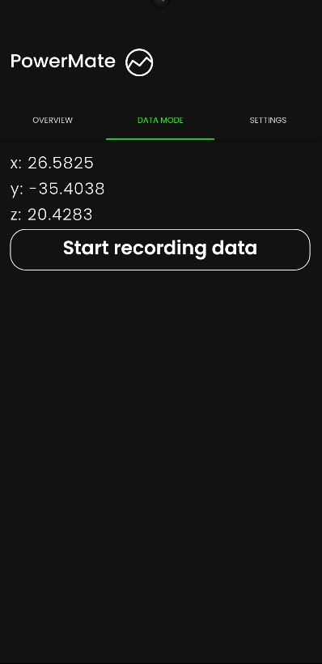
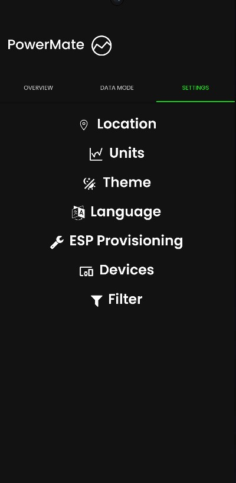

[[_TOC_]]

## Domain concepts

### User

A user is a natural person who has legal access to a gas meter.
For example, a house owner.

### Gas

When talking about gas, [natural gas for household usage](https://en.wikipedia.org/wiki/Natural_gas) is meant.

### Gas meter

A gas meter is a device that measures the volume of gas consumed at a particular location.
To narrow the scope of this project, only gas meters for household usage are considered for now.
This means that the main focus are [Diaphragm/bellows meters](https://en.wikipedia.org/wiki/Gas_meter), or in german [Balgengaszähler](https://de.wikipedia.org/wiki/Balgengasz%C3%A4hler).
It is required that the gas counter is equipped with a rotating magnet.

### Rotating magnet

The rotating magnet is a magnet that is attached to the gas meter and rotates with it.
Not all gas meters are equipped with a rotating magnet.

> Figure 1: Gas meter with rotating magnet visible, the magnet is located in the bottom part of the number 6 on the smallest digit wheel.

### Device

Device in the context of PowerMate are devices that are able to measure the rotation of a magnet, and transform these magnetic measurements into gas consumption data.
The device is connected to the internet.
For now we tested three kinds of devices:

1. ESP8266
   1. Very cheap micro controller with integrated WiFi
2. Raspberry Pi zero
   1. Small computer with integrated WiFi
   2. More expensive than the ESP8266, but allows for better debugging during development
3. Old mobile phones
   1. Some users already have old unused mobile phones at home
   2. These phones are often equipped with a magnetometer
   3. It is not intended to use this kind of device over a long period of time, but it is a good way to test and have initial impressions of the concept

### Rotation conversion

The rotation conversion is a mathematical formula that converts the magnetic measurements into gas consumption data.
Currently a single axis approach is used, this bears some risks as discussed in [section 11](./11.-Risks.md).

The device measures the magnetic field strength every second.

> Figure 2: Z-axis of rotating magnet. Y-Axis of graph contains the magnetic field strength as returned by the sensor, X-Axis displays the time. Every green dot indicates a individual rotation.

Crossings are detected, if the magnetic field strength crosses a threshold, here zero, from a certain direction, here from negative to positive.
Given the timestamp of the last rotation, and the current timestamp, the time between the two rotations can be calculated.
As one rotation of the magnet is equal to $0.01 m^3$ of gas, as indicated by the magnets position and the gas meter label in Figure 1, the gas consumption rate $GCR$ can be calculated from just these values, assuming nanosecond timestamps $t$:

$$
GCR = \frac{3600 \cdot 0.01}{{(t_{now} - t_{last}) \cdot 10^{-9}}}
$$

### Sensor placement

After manual calibration, it was found that the following sensor placement works best for detecting magnet rotations:

## User Experience concepts (UX)

The users of PowerMate are homeowners. They can be both retirees and young people who have some technical experience. PowerMate has been designed to be easily understandable for all target groups:

- to connect the PowerMate device to the gas meter
- set up the PowerMate device using the PowerMate app
- read and understand their gas consumption in the Powermate app.

### User interface

The User Interface of PowerMate is the accompanying app. In the app's home screen, users can observe their gas consumption through a graph. This graph has both a time axis and a consumption axis. Above the graph, there are buttons that allow users to select specific timeframes, such as one hour, six hours, one day, and a user-defined timeframe, with just one click. The tab navigator, positioned above the graph, enables users to easily switch between the "Overview" home screen, the data mode, and the settings with a single click. The data mode is designed to read data from a gas meter by clicking on the "Start Recording Data" button. To verify if the mobile device is properly positioned, there is a display of the x, y, and z axes of the magnet installed in the gas meter, accessible through a button. If the mobile device is correctly attached, users can immediately observe changes in the axis data. By simply clicking on the settings button, users can access various user settings, which are designed to be self-explanatory.

> Figure 3: PowerMate App Homescreen

> Figure 4: PowerMate App Data Mode screen

> Figure 5: PowerMate App Settings screen

### Ergonomics

1. Consistency of user guidance:
The changes in units and themes are structured in the same way. The user recognizes the input again and can reuse their knowledge from the other function.
2. Immediate comprehensibility of user guidance:
The graph is easily understandable. The app's interface is also designed in a way that anyone who can operate a smartphone can use this app. For more complex settings, such as the filter where the personal timeframe can be adjusted, all the information is presented in a way that is easily understandable for a new user.
3. Automation of data retrieval:
The data for the graph is automatically requested in sensible intervals". This ensures that the user always has the most up-to-date gas consumption information.
4. Immediate feedback to the user:
During the ESP setup, if an error occurs, the user is directly given feedback on what went wrong. If the graph fails to display due to internet issues, an error message appears.
5. Self-explanatory capability:
In case of input errors in the settings or empty fields, these input fields turn red to indicate to the user that something went wrong or is missing. This is a feature commonly seen in many other websites or apps.
6. Adaptability to individual needs:
The user can adjust their own timeframe, determining the period over which they want to view their gas consumption.
7. Error tolerance:
When the user enters their place of residence, the API also recognizes street names with typographical errors. However, the level of tolerance depends on the weather API being used.

### Accessibility

The app is accessible to all population groups. This means that anyone who can use a smartphone can also use this app. The only thing that is more challenging is accessing the gas meter for the installation of the sensor. However, we do not have direct control over that.

### Internationalization

So far, the app is available for German and English speakers.

## Safety and security concepts

### Security

## Architecture and design patterns

- Publish/Subscribe pattern for MQTT
- Messaging pattern for message processing

## “Under-the-hood” concepts

### Persistency

The gas consumption rate, which is captured by the ESP8266, is stored in the Timeseries database. This provides a persistent way to access the data, regardless of whether the app is turned on or off.

## Development concepts

### Modularity

The system is structured in a way that each component has its own task. For example, the app is not responsible for data storage, there is a separate database for that purpose.

### Testability 

PowerMate is easily and efficiently testable due to its modularity. Each component has its own scope of tasks, making it straightforward to write integration or system tests.

### Build, Test, Deploy

All projects, if applicable, are continuously built, tested and deployed using [GitLab CI](https://docs.gitlab.com/ee/ci/).
This ensures a fast feedback cycle and a high quality of the code base.

Linting tools are also used to ensure a consistent code style across all projects, and notifies on typical simple errors.
This also speeds up reviews, as the reviewer does not have to focus on code style, and small errors are detected even before a reviewer is assigned.

### Configurability

It is possible to change the units of gas consumption. Furthermore, the user can set their own timeframe for gas consumption within the app, give a custom name to their gas-meter-connected device, switch between Dark/Light mode, and adjust the language to English or German. Also the other modules are configurable with enviroment variables.

## Operational concepts

### Scaling

Due to the fact that we work with AWS services, scalability is easily achievable, as Amazon's components can support very large systems. Also, the fact that we use serverless microservices and a message queue in the ingress, which can handle huge peaks, contributes to making our system highly scalable.

### Monitoring & Logging

All our lambda functions send their logs to a dedicated AWS CloudWatch LogGroup. 
These logs can also be queried by using CloudWatch Log Insights.
Also, there are metrics for the different services which can be displayed there.
We have not spent time yet
to properly visualize these logs and metrics to gain a deeper insight in the health of our application.
This could be achieved by creating a dashboard in AWS Cloudwatch.

### High availability

By combining our AWS services, we were able to create a highly available architecture for our software applications, enabling reliable and uninterrupted usage even in the event of individual component failures.