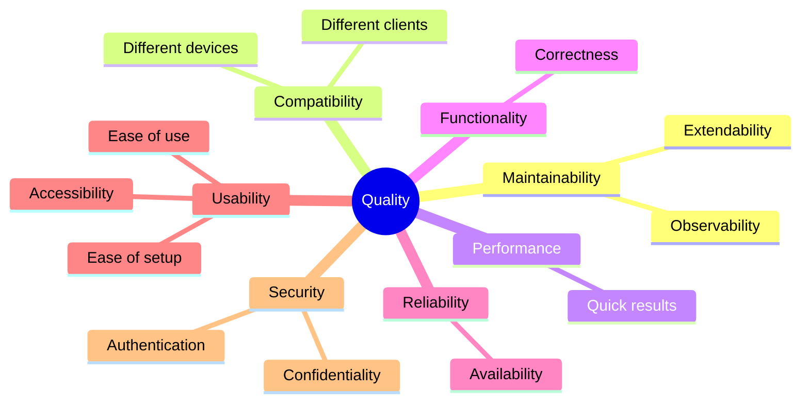

[[_TOC_]]

## 10.1. Quality Requirements

## 10.2. Quality Scenarios

| Quality requirement | Description | (Optional) Implementation or Testing strategy |
| ------------------- | ----------- | --------------------------------------------- |
| Maintainability > Observability | System errors must be detectable and resolvable. | Deploy common observability approaches such as Logging |
| Maintainability > Extendability | A new kind of measurement, such as electricity, must be monitored using PowerMate. | Flexible data model in the database and API design |
||||
| Compatibility > Different devices | Usage of different devices such as ESP8266, Raspberry Pis, or old mobile phones for data acquisition. | Common communication protocol (MQTT) and interfaces (Message schema) |
| Compatibility > Different clients | A new client, such as a browser client, should be able to be introduced. | Common interface for client <-> cloud communication (REST API) |
||||
| Performance > Quick results | A user has connected a device and wants to see their gas usage in less than 15 minutes on their phone. | Asynchronous but decently fast and reliable message processing using the Pub/Sub pattern. Tested via integration tests. |
||||
| Functionality > Correctness | The from the device extracted gas consumption rate should be decently accurate, but does not need to be 100% accurate. | Manual verification using a PowerMate device and the actual gas meter. |
||||
| Reliability > Availability | The PowerMate system should be available most of the times. We allow for elongated downtimes using summer months, but require a high availability during the heating season. | Monitoring and alerting. |
||||
| Usability > Ease of use | The app should be easy to learn and use. | Minimal user interface with small amount of clutter. |
| Usability > Ease of setup | The device should be easy to setup. | Provide user guides for setup with images and videos. Perform regular user tests. |
| Usability > Accessibility | The app must be accessible to users who don't speak german or have vision issues. | Use internationalization and color blind friendly color pallets in the PowerMate App. |
||||
| Security > Confidentiality | As a user i want that only i can see my gas consumption. | Use a strict access control in the REST API layer, tested via integration tests (NOT FULLY IMPLEMENTED YET). |
| Security > Authentication | Only authenticated users should see their data | Same access control in the REST API layer, tested via integration tests (NOT FULLY IMPLEMENTED YET). |
