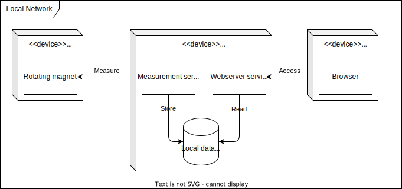

This document contains the required alternative architectures as required in the syllabus.

[[_TOC_]]

## Local only architecture

A completely different approach could be to not use any cloud services at all, and perform every action needed in the local network of the user.

### Pros

- No need for a cloud service
- Maximum data protection
- Very low complexity

### Cons

- No or harder remote access
- No resource sharing
  - One computer, such as raspberry Pi, has to run per user and gas counter
  - No shared database or server
- Maintenance is left to the user
  - Setting up server
  - Installing updates
  - Performing backups
  - ...

## Non AWS / public cloud client-server architecture

A slightly different architecture approach could have been to implement a similar architecture, but not using a cloud provider's provided services.
This would mean hosting the required server(s) or cluster yourself or renting machines from cloud providers.

This would roughly result in the following (minimal) architecture:

Here server or cluster means, that either every piece of the server code could be deployed on one server, or in a cluster as multiple services.

### Pros

- No vendor lock-in
- Predictable costs
- More control over the system
- Can handle multiple users and gas meters
- More control over data location and traffic flow

### Cons

- More maintenance
  - Setup and maintenance of the server or cluster
- Custom solutions for certificate management in MQTT for example
  - IoT core handles a lot in MQTT certificate management, which would be lost
- No scale to zero
  - Except if the server is completely shutdown
  - Serverless solutions from AWS, such as lambdas or IoT Core, scale to zero, which means if there is no demand, no costs are incurred

## Integration for smart home systems

A similar solution to the AWS-less architecture would be to integrate the gas meter into an existing smart home system, such as [Home Assistant](https://www.home-assistant.io/), or [OpenHAB](https://www.openhab.org/)
This would mean that the gas meter would be integrated into the smart home system, and the smart home system would be responsible for the data storage and processing.

### Pros

- Visualization of data in smart home system
- Control of other smart home devices based on gas meter data
- Good for users who already have a smart home system

### Cons

- Less custom control over the system
- Most likely only for a single home
