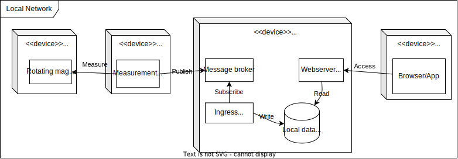

This document contains the required alternative architectures as required in the syllabus.

[[_TOC_]]

## Cloudless Self-Host alternative

One alternative of the PowerMate architecture is to not use any cloud services at all, and perform every action needed in the local network of the user.

Consider this following diagram:

### Pros

- Maximum data protection, everything is locally
- Very low complexity, no need for cloud services or their interfaces
- Maximum control over the system, no dependence on external services

### Cons

- No or harder remote access:
  - has to be done via VPN or similar or
  - service has to be exposed, but bears security risks
- No easy resource sharing globally
  - One sever hosting everything per user
- Responsibility is solely on the user regarding the servers and services:
  - installation
  - maintenance
  - updates

The main difference to the PowerMate architecture clearly is that the cloud services are not used at all. Tough this has some advantages, it also has some disadvantages mainly regarding the maintenance of the system and the availability of the system. In addition, data is not available globally, but only locally. This means that the user has to be in the same network as the server to access the data. This could be solved by exposing the server to the internet, but bears security risks and is not recommended.

## Proprietary ecosystem alternative

A different route to go is to use a proprietary ecosystem, such as [Apple's HomeKit](https://www.apple.com/de/shop/accessories/all/homekit) or [Google's Nest](https://store.google.com/de/category/connected_home?hl=de&pli=1). This would mean that the user would have to buy into the ecosystem and use the services provided by the ecosystem, be it applications or extension hardware to be installed. In addition, the user would have to use the app provided by the ecosystem to access the data, and the data would be stored in the cloud of the ecosystem provider.

### Pros

- Easy to use and no maintenance, everything is provided and maintained by the ecosystem provider
- Support possibilities if problems arise
- Data is stored in the cloud of the ecosystem provider and available globally, no need for the user to maintain a server or be in the same network as the server

### Cons

- Costs money, the user has to buy into the ecosystem
- Perhaps even additional hardware and users expense is needed if the existing inventory is not compatible with the ecosystem
- Vendor lock-in, the user is dependent on the ecosystem provider
- No control over the system, be it the hardware or the software, what and where data is stored

Being a complete different direction of what PowerMate stands for, this alternative architecture is not considered further. The main reason is that the user is dependent on the ecosystem provider, and the user has no control over the system. In addition, the user has to buy into the ecosystem, which means that the user has to buy additional hardware and software to use the ecosystem. This is not in the spirit of PowerMate, which is to provide a cheap and easy to use solution for the user.
