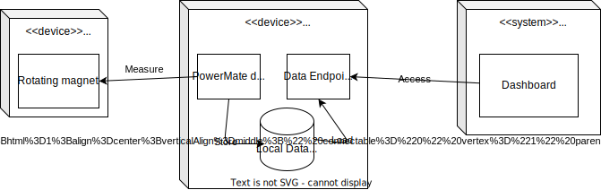
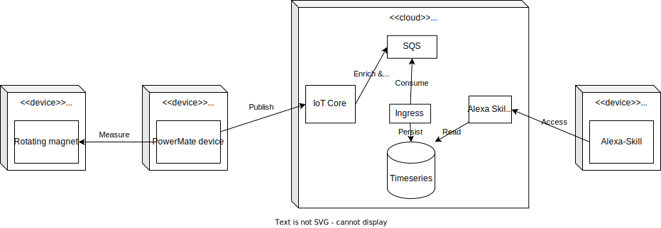

This document contains the required alternative architectures as required in the syllabus.

[[_TOC_]]

## Only dashboard alternative (SaaS)

An alternative to the existing PowerMate architecture would be to remove the need for an application. Instead, use a Software as a Service solution such as Grafana as a user interface to visualize gas consumption.

Comparing it to our actual architechture, there would be no need to use AWS, as everything could be hosted locally.

### Pros

- Faster development: By using SaaS, the team could rapidly provide a solution for the user interface. This would allow spending more time and resources on delivering a robust solution for the Phone as a Device problem. In addition, it would allow reinvesting the saved time in other key features.

- Rich data visualization: Grafana provides a diverse set of visualization options and plugins, allowing users to create visually appealing and interactive dashboards. It offers a wide range of charts, graphs, and other visual elements to represent data effectively.

- Open-Source and Community-Driven: Grafana is an open-source project with a large and active community. This means there are numerous resources, documentation, and community-contributed plugins and extensions available for users to improve and customize their dashboard experience.

### Cons

- Device Compatibility: Cross-platform applications are specifically designed to run on multiple devices and operating systems seamlessly. Grafana, while accessible from different devices through web browsers, may not provide the same native user experience on all platforms.

- Limited Non-Visual Features: Cross-platform applications can include a wide array of non-visual features such as notifications and alerts, which might be limited or require additional integration efforts when using Grafana.

## Alexa integration

When it comes to knowing everything about your home, smart home integrations have become more and more popular. A possible architecture would be to include an Amazon Alexa device. This device has access to the data and prompts it to the user whenever we asks for the state of the home.

This architechture would stay the same, except the exchange of the frontend for and alexa supporting device, in this example Alexa Echo.

### Pros

- Centralized Control: Assuming users integrate PowerMate into an existing smart home ecosystem, they can access and manage data insights, monitor device performance, and make informed decisions about their smart home environment, all from one place.

- Unusual Gas Consumption: PowerMate can recognize abnormal spikes in gas usage, indicating potential inefficiencies or waste. When detected, Alexa can notify users to investigate the issue further, helping identify and resolve equipment malfunctions or energy-wasting behaviors.

- Smart Home Automation: Alexa can recommend creating automation routines that optimize gas usage based on user preferences and schedules. For instance, Alexa can suggest setting up a routine to automatically adjust the thermostat when users are away from home or lowering the temperature during sleeping hours.

### Cons

- Limited Visual Representation: While Alexa skills can offer voice-driven data interaction, they lack the rich visual representation capabilities of traditional data visualization tools like Grafana. Complex charts, graphs, and visual elements may not be effectively conveyed through voice alone.

- Voice Detection Challenges: Misinterpretations of user commands or queries could lead to inaccurate responses or frustration for users.