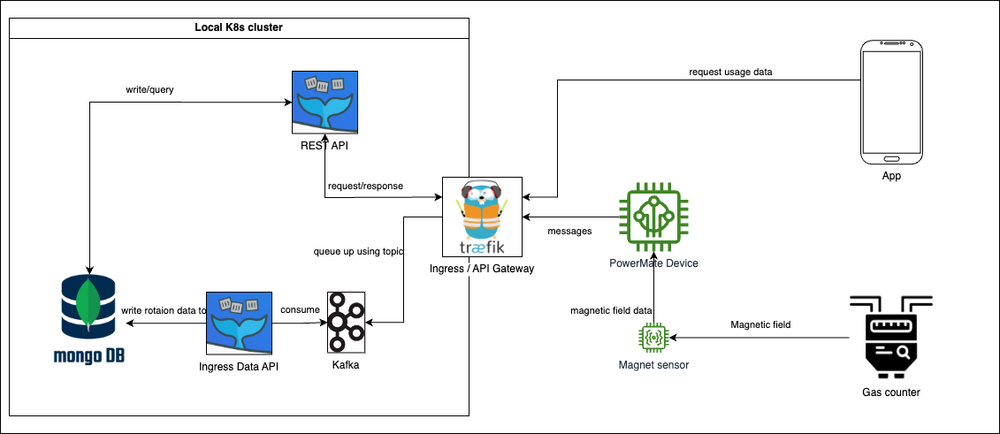

This document contains the required alternative architectures as required in the syllabus.

[[_TOC_]]

# Cloudless kubernetes with OpenFaaS

## 1. Hardware Components

### 1.1 Gas Meter
The gas meter generates a periodically changing magnetic field when the rightmost wheel of the gas meter rotates.

### 1.2 ESP + Magnet Sensor / Phone with built-in Magnet Sensor
The ESP with magnet sensor or mobile phone with a built-in magnet sensor is being attached to the gas meter
to capture the magnetic field data and transmit it to the local infrastructure.

## 2. Local Kubernetes Cluster
A local Kubernetes cluster consisting of multiple nodes is being
installed for instance using [kubespray](https://kubernetes.io/docs/setup/production-environment/tools/kubespray/).
We will use this cluster to host our infrastructure in a very fault-tolerant way. 

## 2.1 Functions as a Service (FaaS):

FaaS platforms, such as OpenFaaS or Kubeless can be used within the local Kubernetes cluster to execute serverless 
functions. They could replace all of our lambda functions in our implementation.

## 2.2 API and Endpoints

Serverless functions can be created that act as our rest-api endpoints to provide access to the gas consumption data.
These functions can be exposed via an API gateway which is our kubernetes ingress

## 2.3 (NoSQL) Database 
MongoDB is a popular NoSQL document-oriented database that offers flexibility and scalability for unstructured or semi-structured data. 
It provides high availability, automatic sharding, and horizontal scalability. 
MongoDB can be deployed as a statefulset or using operator-based solutions in Kubernetes.

## 2.4 Message Queue
Containerized services, such as Apache Kafka can be setup within the cluster to handle the incoming magnetic field data.
Incoming magnetic field data can be published to a kafka topic, which will serve as a queue for further processing by the serverless functions.

## 2.4 Ingress / API Gateway
An Ingress controller,
such as [Traefik](https://doc.traefik.io/traefik/v1.7/user-guide/kubernetes/) could act as the API gateway into the cluster.
Configure the API gateway to serve as the entry point for external requests
and route them to the appropriate FaaS functions based on defined endpoints.
The API gateway could handle authentication, rate limiting, request transformation, and other API-related tasks.
Also, it could handle routing and load balancing to the appropriate functions

## 2.5 Monitoring & Network Security

Employment of monitoring and logging tools, such as Prometheus and Grafana, could be used to monitor the performance and 
health of the Kubernetes cluster and its serverless functions.
[Cilium](https://cilium.io/) could be used to provide powerful network security capabilities for the cluster.
By enforcing fine-grained network policies, control and restriction of communication between services could be achieved, 
reducing the attack surface and preventing unauthorized access.
Cilium's built in Hubble also offers rich observability features, which allow to gain deep insights into network traffic within the cluster.
Metrics related to network flows, connectivity, and security policies could be collected and visualized.

Advantages of this architecture:

Serverless benefits: By leveraging FaaS, you can focus on writing and deploying code without worrying about infrastructure management. It also provides automatic scaling and cost efficiency based on demand.
Disadvantages of this architecture:

Infrastructure complexity: Setting up and managing a local Kubernetes cluster requires technical expertise and effort.
Operational overhead: Running and maintaining a Kubernetes cluster and FaaS platforms involve ongoing operational tasks, including updates, monitoring, and scaling configurations.
Please note that implementing this architecture requires familiarity with Kubernetes, containerization, and FaaS platforms. Consider the specific requirements and resources available for your project to ensure the feasibility and suitability of this approach.

### Pros

- Fault tolerance: Kubernetes provides fault tolerance mechanisms, such as pod restarts and automatic scaling, to ensure high availability.
- Scalability: Kubernetes enables horizontal scaling and load balancing of the deployed services to react dynamically to increased workloads.
- Kubernetes provides scalability, fault tolerance and container orchestration capabilities for efficient deployment and management of applications.
- Efficient resource utilization: Kubernetes optimizes resource allocation and utilization, ensuring efficient usage of compute resources within the cluster.
- Serverless: FaaS platforms handle the scaling of functions automatically based on the incoming workload. As the number of requests increases, the platform provisions additional instances to handle the load. Similarly, when the load decreases, the platform scales down automatically.
- Kafka: its distributed nature and fault tolerance make it suitable for handling high-volume data streams. It enables decoupling of data producers and consumers, allowing for flexible and parallel processing of the data.
### Cons

- Increased complexity: Implementing the proposed architecture with a local cluster and FaaS can introduce additional complexity compared to the original approach. Managing a cluster, configuring FaaS platforms, and integrating various components require additional knowledge and expertise.
- Operational overhead: Operating and maintaining a local Kubernetes cluster and FaaS platforms involve ongoing tasks such as updates, monitoring, troubleshooting, and scaling configurations. This requires dedicated resources and expertise to ensure smooth operation of the infrastructure.
- Resource requirements: Running a local cluster can have higher resource requirements compared to simpler architectures. This includes CPU, memory, storage, and network resources. Ensuring that the hardware the cluster runs on meets these requirements and can handle the anticipated workload is essential.
- Lack of cloud benefits: Using a local architecture means foregoing some of the benefits offered by cloud-based solutions as AWS in the original approach. This is for example the built-in observability, managed services, and automatic infrastructure provisioning.