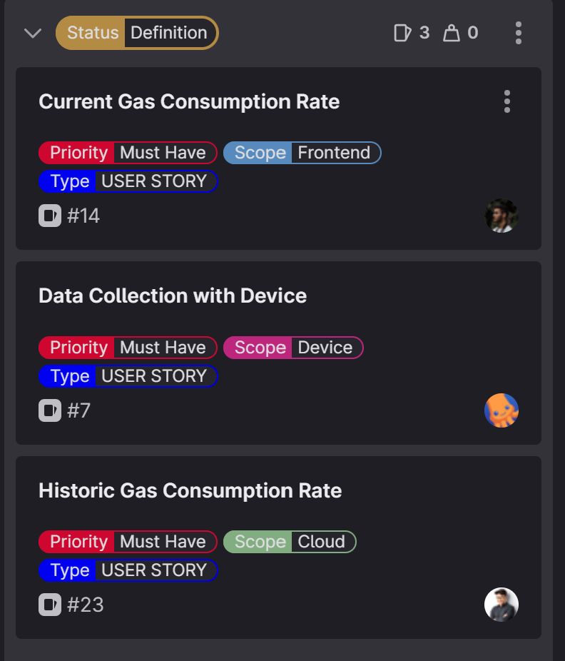
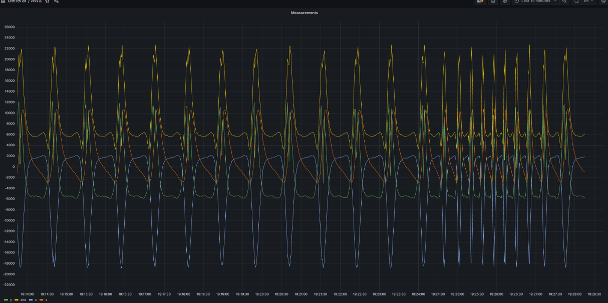
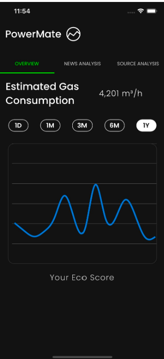
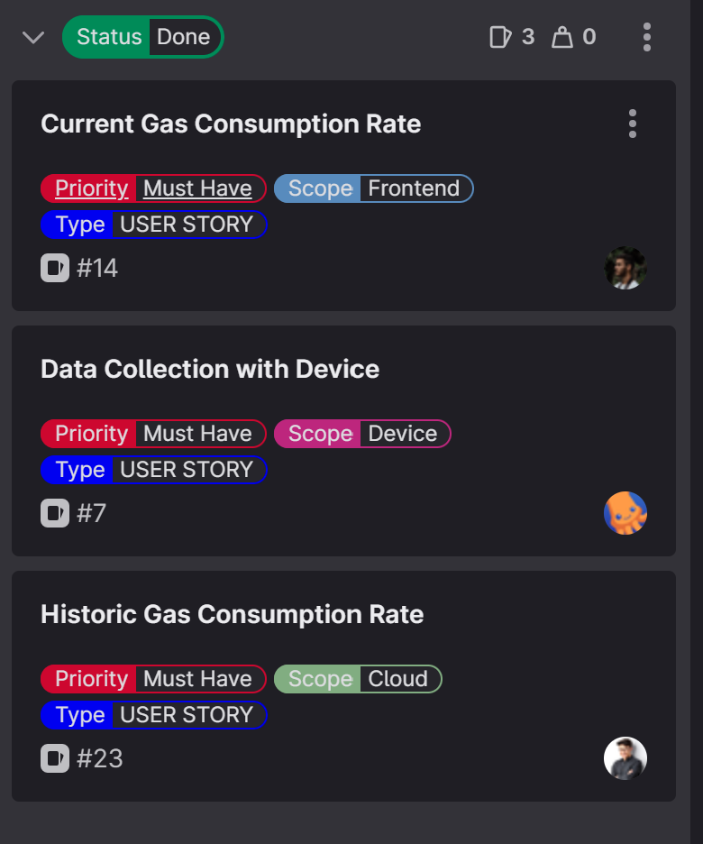

[[_TOC_]]

# SPRINT Goal and Backlog 
- This is the SPRINT number 1
- **TIMELINE**: The SPRINT#1 takes place from 20.04.2023 until 27.04.2023
- **We have defined the Goal for this SPRINT#1 as**: 
  - [US-7](https://gitlab.lrz.de/studi_projects/2023ss_d3i/pc1_umweltinstitut/scrum_management/-/issues/7): Having a device collecting data
  - [US-14](https://gitlab.lrz.de/studi_projects/2023ss_d3i/pc1_umweltinstitut/scrum_management/-/issues/14): Having **currect** collected gas consumption data shown
  - [US-23](https://gitlab.lrz.de/studi_projects/2023ss_d3i/pc1_umweltinstitut/scrum_management/-/issues/23): Having **historic** collected gas consumption data shown
  - Out of Scope of Scrum: IAC setup, CI/CD Pipelines

# SPRINT Backlog  

# SPRINT Review Agenda
- Collecting Data / Historic and Current Data

# SPRINT Result = INCREMENT

