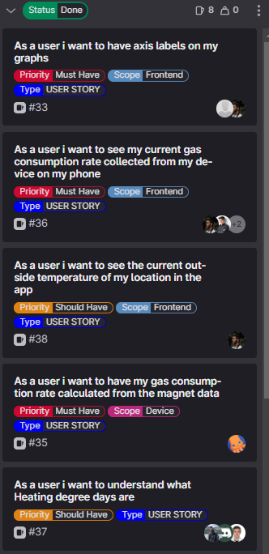

[[_TOC_]]

# SPRINT Goal and Backlog 
- This is the SPRINT number 2
- **TIMELINE**: The SPRINT#2 takes place from 27.04.2023 until 04.05.2023
- **We have defined the Goal for this SPRINT#2 as**: 
  - [US-35](https://gitlab.lrz.de/studi_projects/2023ss_d3i/pc1_umweltinstitut/scrum_management/-/issues/35): Gas Consumption from Magnet Sensor Data
  - [US-36](https://gitlab.lrz.de/studi_projects/2023ss_d3i/pc1_umweltinstitut/scrum_management/-/issues/36): Current Gas Consumption From Actual Device
  - [US-33](https://gitlab.lrz.de/studi_projects/2023ss_d3i/pc1_umweltinstitut/scrum_management/-/issues/33): Axis Labels on Graphs
  - [US-38](https://gitlab.lrz.de/studi_projects/2023ss_d3i/pc1_umweltinstitut/scrum_management/-/issues/38): Current Outside Temeprature in App
  - [US-37](https://gitlab.lrz.de/studi_projects/2023ss_d3i/pc1_umweltinstitut/scrum_management/-/issues/37): Understand Heating Degree Days

# SPRINT Backlog  

# SPRINT Review Agenda
## Review feedback:
    - Leo was interested in Architecture, but it is way too complex, we need to explain it better
        - less jargon
        - explain to grandma
    - actual energy usage in kWh, not in m^3/h
        - two kinds of gas: high / low caloric (fraction methane)
        - users do not know which
        - depends on location
        - from last invoice gas consumption / kWh
    - Fourier transform of data instead of zero crossing
    - HDD
        - 15.5 °C
        - weather database
        - maybe it exists already but maybe calculate
    - Energy efficiency class of users building
        - Energy efficiency class means how many kw/H per m^2 do I need to heat my building
        - how much and when to heat
        - heated area
        - combine with HDD to define a score
        - kWh / m² / year is the meaning
        - this would be a key benefit
    - hidden tetris game
    - App design
        - looks very clean
        - confirm not by coordinates, but actual location
    - Questionnaire for installation for users

# SPRINT Result = INCREMENT
