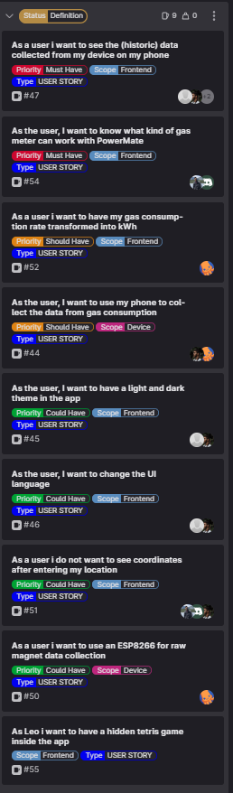
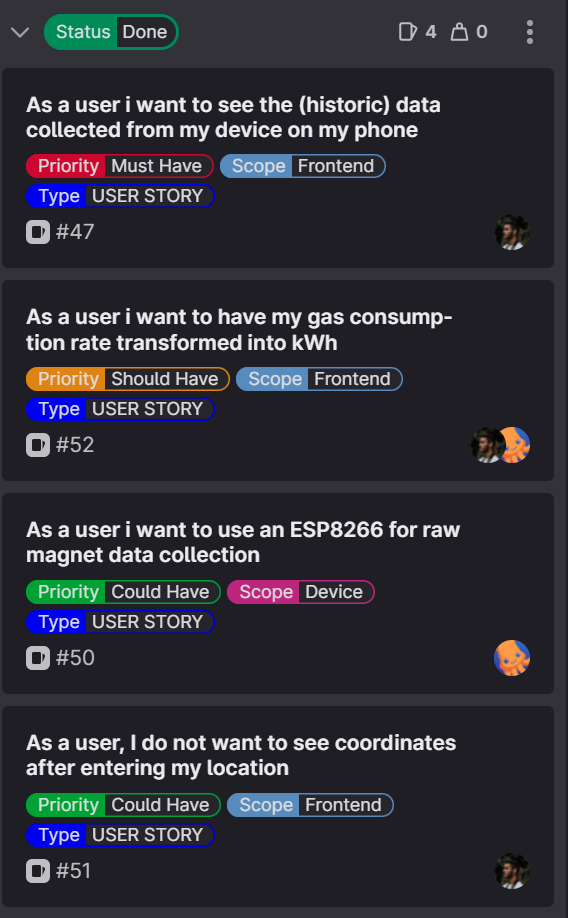

[[_TOC_]]

# SPRINT Goal and Backlog 
- This is the SPRINT number 3
- **TIMELINE**: The SPRINT#3 takes place from 04.05.2023 until 011.05.2023
- **We have defined the Goal for this SPRINT#3 as**: 
  - [US-47](https://gitlab.lrz.de/studi_projects/2023ss_d3i/pc1_umweltinstitut/scrum_management/-/issues/47): Historic Data From Device
  - [US-54](https://gitlab.lrz.de/studi_projects/2023ss_d3i/pc1_umweltinstitut/scrum_management/-/issues/54): What Has Meters Work With Powermate
  - [US-52](https://gitlab.lrz.de/studi_projects/2023ss_d3i/pc1_umweltinstitut/scrum_management/-/issues/52): kW/h hours
  - [US-45](https://gitlab.lrz.de/studi_projects/2023ss_d3i/pc1_umweltinstitut/scrum_management/-/issues/45): Phone As Device
  - [US-46](https://gitlab.lrz.de/studi_projects/2023ss_d3i/pc1_umweltinstitut/scrum_management/-/issues/46): UI Language
  - [US-51](https://gitlab.lrz.de/studi_projects/2023ss_d3i/pc1_umweltinstitut/scrum_management/-/issues/51): Address Instead Coordinates
  - [US-50](https://gitlab.lrz.de/studi_projects/2023ss_d3i/pc1_umweltinstitut/scrum_management/-/issues/50): ESP As Device
  - [US-55](https://gitlab.lrz.de/studi_projects/2023ss_d3i/pc1_umweltinstitut/scrum_management/-/issues/55): Tetris

# SPRINT Backlog  

# SPRINT Review Agenda
## Leo's Feedback
- Validate manually if the data collected from Alex is correct and is good with the actual gas consumption number
- show kw/h for the time frame -> integral of the graph
- current gas rate, round to two or three total, he doubts its possible to measure that precise
- 1 week time frame?; from leo's solar stuff: 1d, 1w, 1m, 1y, or custom select
- export data? csv format
- slight misunderstanding: green is good? Could be misconception
- base load should not be green, it's less, but not good
  - Perception of color affecting the eye differently (BA research task)?
- tie the color to the house green efficiency and HDD
- Create the connection from the device to your wifi as easy as possible.
- Add feature to show off the consumption publicly – to compare to your direct neighbor – maybe compare it to energy efficiency classes of similar homes in similar neighborhoods
- Design 2 tabs one showing power and one showing Energy 
rename the displayed wording to “current consumption”/ “aktueller Verbrauch” and maybe then show last 24hours/7Days/ etc.
  - As a user I want to understand the difference between Energy and Power (suggestion Brehm)

# SPRINT Result = INCREMENT
