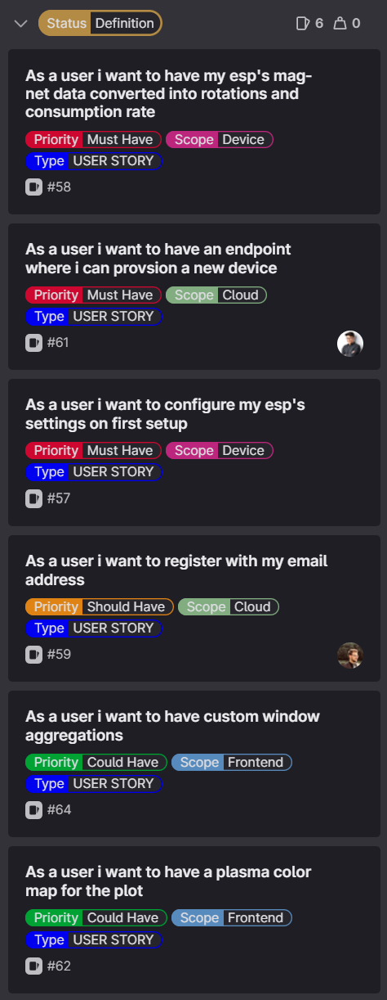
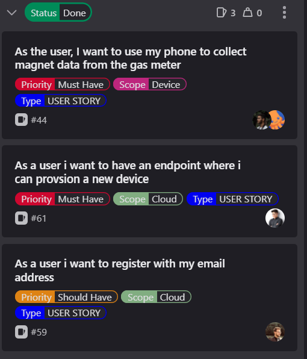

[[_TOC_]]

# SPRINT Goal and Backlog 
- This is the SPRINT number 4
- **TIMELINE**: The SPRINT#4 takes place from 11.05.2023 until 25.05.2023
- **We have defined the Goal for this SPRINT#4 as**: 
  - [US-58](https://gitlab.lrz.de/studi_projects/2023ss_d3i/pc1_umweltinstitut/scrum_management/-/issues/58): ESP Magnet Data
  - [US-61](https://gitlab.lrz.de/studi_projects/2023ss_d3i/pc1_umweltinstitut/scrum_management/-/issues/61): Provisioning Endpoint
  - [US-57](https://gitlab.lrz.de/studi_projects/2023ss_d3i/pc1_umweltinstitut/scrum_management/-/issues/57): ESP settings configuration
  - [US-59](https://gitlab.lrz.de/studi_projects/2023ss_d3i/pc1_umweltinstitut/scrum_management/-/issues/59): User Registration
  - [US-64](https://gitlab.lrz.de/studi_projects/2023ss_d3i/pc1_umweltinstitut/scrum_management/-/issues/64): Custom Window Aggregations
  - [US-62](https://gitlab.lrz.de/studi_projects/2023ss_d3i/pc1_umweltinstitut/scrum_management/-/issues/62): Plasma Color Plot

# SPRINT Backlog  

# SPRINT Review Agenda
## Leo's Feedback
He is happy

# SPRINT Result = INCREMENT
