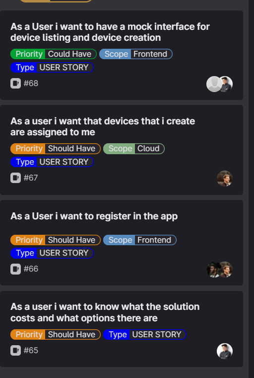
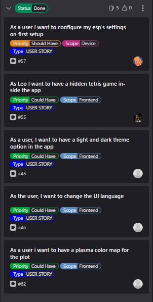

[[_TOC_]]

# SPRINT Goal and Backlog 
- This is the SPRINT number 5
- **TIMELINE**: The SPRINT#5 takes place from 25.05.2023 until 07.06.2023
- **We have defined the Goal for this SPRINT#5 as**: 
  - [US-68](https://gitlab.lrz.de/studi_projects/2023ss_d3i/pc1_umweltinstitut/scrum_management/-/issues/68): Device Creation
  - [US-67](https://gitlab.lrz.de/studi_projects/2023ss_d3i/pc1_umweltinstitut/scrum_management/-/issues/67): User-Device Association
  - [US-66](https://gitlab.lrz.de/studi_projects/2023ss_d3i/pc1_umweltinstitut/scrum_management/-/issues/66): App Registration
  - [US-65](https://gitlab.lrz.de/studi_projects/2023ss_d3i/pc1_umweltinstitut/scrum_management/-/issues/65): Solution Cost

# SPRINT Backlog  

# SPRINT Review Agenda
## Leo's Feedback

# SPRINT Result = INCREMENT
